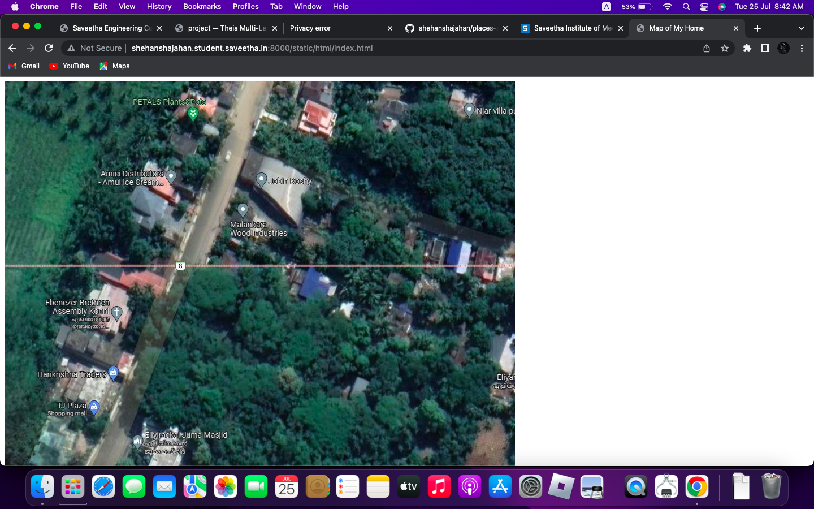
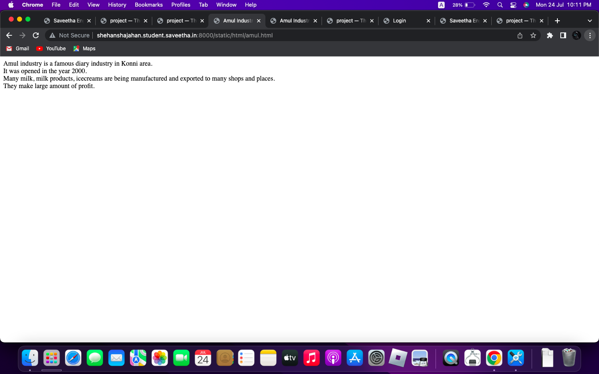
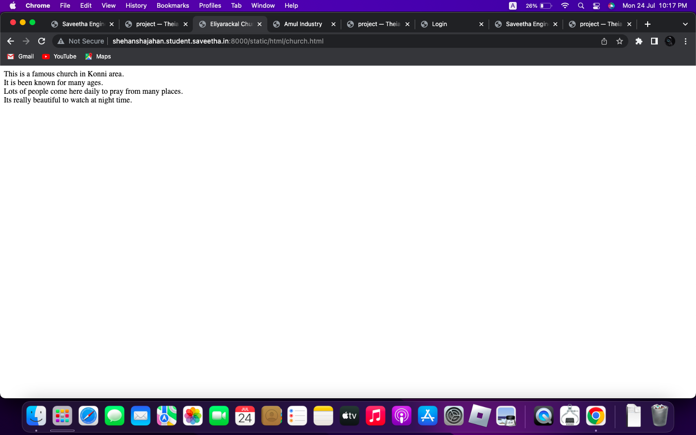
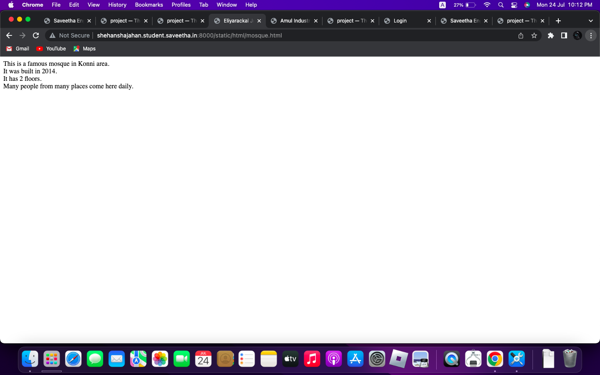
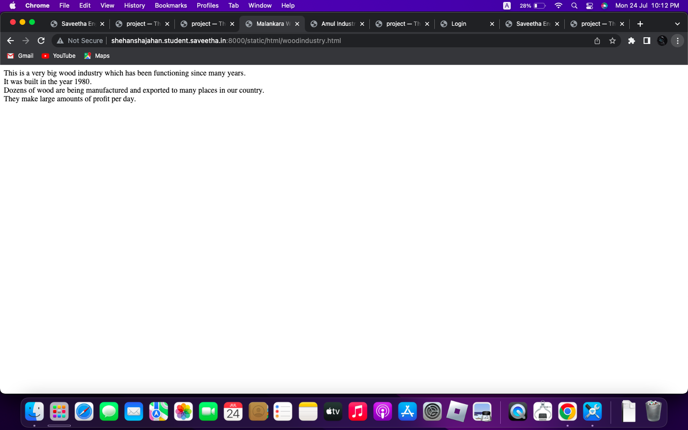
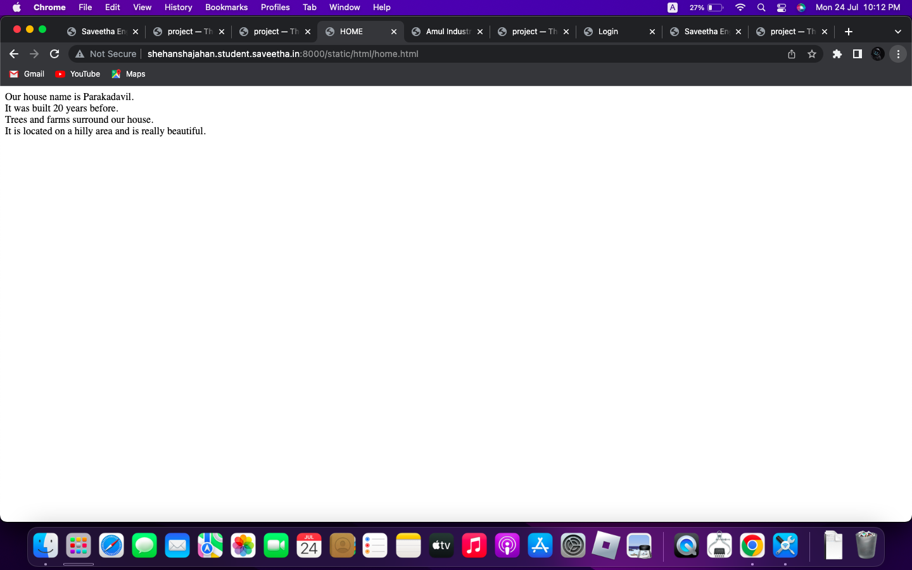
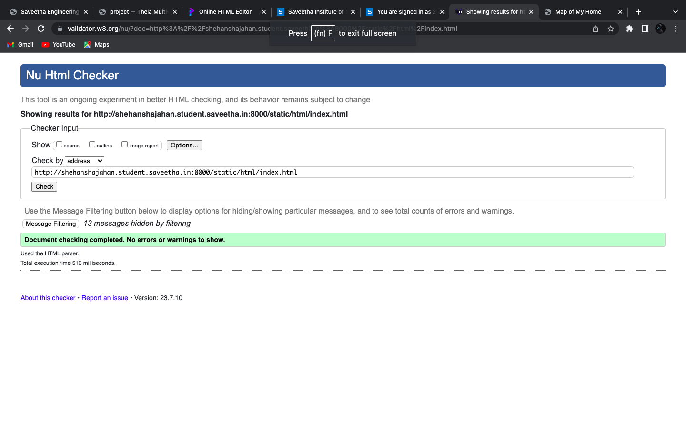

# Places Around Me
## AIM:
To develop a website to display details about the places around my house.

## Design Steps:

### Step 1:
Create 'ex04' directory.
### Step 2:
Create project 'myproj' using "django-admin startproject myproj".
### Step 3:
Create myapp using "python3 manage.py startapp myapp".
### Step 4:
Create image map using image-maps.com.
### Step 5:
Create necessary webpages for the places on the map.
### Step 6:
Push to README.md and push to github repository.

## Code:
### index.html:
```html
<!DOCTYPE html>
<html>
    <head>
        <title>Map of My Home</title>
    </head>
    <body>
        
        <map name="image-maps-2023-07-24-083103" id="ImageMapsCom-image-maps-2023-07-24-083103">
        <area  alt="" title="Amul" href="amul.html" shape="rect" coords="161,127,343,272" style="outline:none;" target="_self"     />
        <area  alt="" title="Church" href="church.html" shape="rect" coords="57,354,259,456" style="outline:none;" target="_self"     />
        <area  alt="" title="Mosque" href="mosque.html" shape="rect" coords="232,590,434,692" style="outline:none;" target="_self"     />
        <area  alt="" title="Woodindustry" href="woodindustry.html" shape="rect" coords="362,210,564,312" style="outline:none;" target="_self"     />
        <area shape="rect" coords="901,752,903,754" alt="Image Map" style="outline:none;" title="Image Map" href="https://www.image-maps.com/" />
        <area  alt="" title="Home" href="home.html" shape="poly" coords="664,376,626,451,742,493,775,418" style="outline:none;" target="_self"     />
        </map>
    </body>
</html>
```
### amul.html:
```html
<!DOCTYPE html>
<html>
    <head>
        <title>Amul Industry</title> 
    </head>
    <body>
        Amul industry is a famous diary industry in Konni area.
        <br>
        It was opened in the year 2000.
        <br>
        Many milk, milk products, icecreams are being manufactured and exported to many shops and places.
        <br>
        They make large amount of profit.
    </body>
</html>
```
### church.html:
```html
<!DOCTYPE html>
<html>
    <head>
        <title>Eliyarackal Church</title> 
    </head>
    <body>
     This is a famous church in Konni area.
     <br>
     It is been known for many ages.
     <br>
     Lots of people come here daily to pray from many places.
     <br>
     Its really beautiful to watch at night time.
    </body>
</html>
```
### mosque.html:
```html
<!DOCTYPE html>
<html>
    <head>
        <title>Eliyarackal Juma Mosque</title> 
    </head>
    <body>
        This is a famous mosque in Konni area.
        <br>
        It was built in 2014.
        <br>
        It has 2 floors.
        <br>
        Many people from many places come here daily.
    </body>
</html>
```
### woodindustry.html:
```html
<!DOCTYPE html>
<html>
    <head>
        <title>Malankara Wood Industry</title> 
    </head>
    <body>
        This is a very big wood industry which has been functioning since many years.
        <br>
        It was built in the year 1980.
        <br>
        Dozens of wood are being manufactured and exported to many places in our country.
        <br>
        They make large amounts of profit per day.
    </body>
</html>
```

## Output:
### index.html:

### amul.html:

### church.html:

### mosque.html:

### woodindustry.html:

### home.html:

### validator:


## Result:
Image-maps has been created successfully.